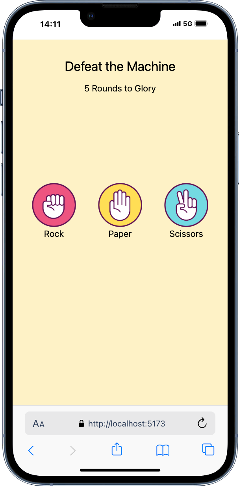
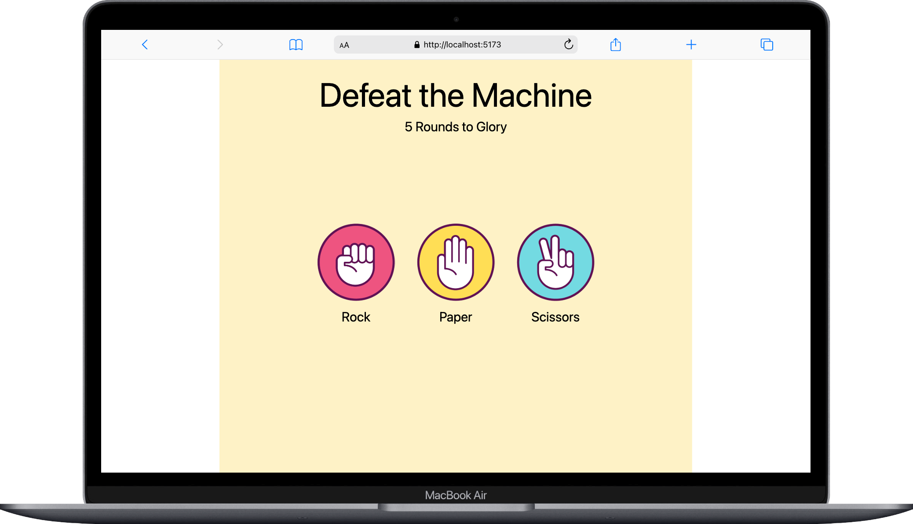

# Rock // Paper // Scissors

[iPhone-13-PRO-localhost-i-dg-q58r-udeo.webm](https://github.com/user-attachments/assets/fd050e4e-0679-46b0-8608-2ee1675b1495)


Das „Rock Paper Scissors Game“ wurde im Rahmen eines Web-Development-Kurses entwickelt. Hauptziel war es, meine Kenntnisse in React, insbesondere der Verwendung von useState() zu vertiefen. In diesem Projekt habe ich ein interaktives Spiel erstellt, bei dem der Nutzer gegen den Computer antritt und aus den klassischen Optionen „Rock“, „Paper“ und „Scissors“ wählen kann. Nach jeder Auswahl wird das Ergebnis direkt angezeigt, und der Nutzer hat jederzeit die Möglichkeit, das Spiel zurückzusetzen. Zudem wird der Spielstand über mehrere Runden hinweg verfolgt. Das Spiel verfolgt den Punktestand über mehrere Runden hinweg und endet nach 5 Runden automatisch. Am Ende zeigt das Spiel eine Gesamtbewertung an, die den Spieler entweder als Sieger, Verlierer oder als gleichwertigen Gegner zum Computer darstellt. Dies ermöglicht eine spannende und herausfordernde Spielerfahrung mit einer klaren Endauswertung.

## Table of Contents 

- [Über das Projekt](#über-das-projekt)
- [Tech Stack](#tech-stack)
- [Getting Started](#getting-started)
  - [Voraussetzungen](#voraussetzungen)
  - [Installation](#installation)
- [Design](#design)
- [Deployment](#deployment)

## Über das Projekt

<div style="display: flex; flex-direction: row; justify-content: space-between; align-items: center; width: 100%; margin-bottom: 5vh">
    
    

</div>


In diesem Projekt wird die Spiellogik mit useState() und useEffect() gesteuert. Der handleClick-Handler verwaltet die Auswahl des Spielers und des Computers und prüft das Ergebnis der Runde. Die useEffect()-Hook wird verwendet, um nach fünf Runden das Endergebnis anzuzeigen und die Nachricht entsprechend zu gestalten (z. B. „Du hast gewonnen“ oder „Die Maschine hat gewonnen“). Nach jedem Spiel kann der Benutzer das Spiel zurücksetzen, um von vorne zu beginnen.

Die grundlegenden Funktionen umfassen:

* Auswahl der Spieloptionen durch den Nutzer
* Zufällige Auswahl des Computers aus denselben Optionen
* Anzeige des Ergebnisses (Gewinn, Verlust oder Unentschieden)
* Zählung der Runden und Spielstandanzeige
* Möglichkeit, das Spiel zurückzusetzen
* Anzeige der Gesamtbewertung aus 5 Runden

## Tech Stack
  
**Markup:**  
  

**Styling:**<br/>

  

**IDE:**  
  

**TS:**<br/>


**Library**<br/>


**Version Control:**  
  


## Getting Startet

Hier ist eine Anleitung, wie du das „Rock Paper Scissors“-Projekt auf deinem lokalen Rechner einrichtest und ausführst:


### Voraussetzungen

Folgende Programme solltest du installiert haben:

- [Git](https://git-scm.com/)
- [VS Code](https://code.visualstudio.com/download)
- [Vite](https://v5.vite.dev/guide/)<br/>
(wähle bei der Installation von Vite "React" und anschließend "Typescript")
- [Tailwind CSS](https://tailwindcss.com/docs/installation/using-vite)

### Installation

1. **Clone das "Repository":**
   ```bash
   git clone https://github.com/YvonneJL/Rock-Paper-Scissors-React-Project
   ```

### Ausführen des Projekts

2. **Öffne das Projekt und installiere Vite und Tailwind Css, indem du den Instruktionen auf den oben verlinkten Webseiten folgst :**
 
**Alles ist eingerichtet! Nun kannst du das "Rock Paper Scissors Game"-Projekt erkunden und spielen.

## Design

Für das Design des Spiels habe ich mich für ein minimalistisches Layout entschieden, das den Fokus auf die Interaktivität und das Spiel selbst legt. Die Auswahlmöglichkeiten für den Nutzer werden als klickbare Bilder dargestellt, die jeweils die Optionen „Rock“, „Paper“ und „Scissors“ repräsentieren. Das Ergebnis wird in Form eines Textes angezeigt und lässt den Spieler wissen, ob er gewonnen, verloren oder unentschieden gespielt hat. Die Runden und der aktuelle Punktestand werden visuell angezeigt, um das Spielerlebnis noch interaktiver zu gestalten.


## Deployment

Hier gelangst du direkt zur Webseite
- [Rock Paper Scissors Game](https://rock-paper-scissors-react-project.vercel.app/)

